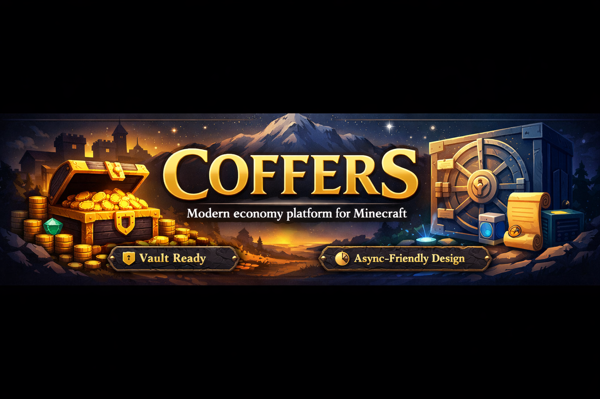

# Coffers

Coffers is a fresh, from-scratch economy platform for modern Minecraft servers.

The direction is simple:

- Keep the good part of Vault: a stable abstraction other plugins can depend on.
- Avoid the old Vault trap: baking every integration directly into one giant legacy plugin model.
- Leave room for newer ideas like richer transactions, multi-currency, async storage, and cleaner bridges.

## What Server Owners Install

Server owners only need one plugin jar:

- `release/Coffers.jar`

Vault compatibility is built into the main plugin and can be set to:

- `auto`: register with Vault only when Vault is installed
- `enabled`: force Coffers to expose a Vault economy provider when Vault is present
- `disabled`: never register the Vault bridge

## Project Layout

- `coffers-paper`: the real Paper plugin server owners install
- `coffers-api`: the developer-facing API definitions for plugins that want to integrate directly with Coffers
- `assets`: repository artwork such as the README banner
- `release`: generated convenience output for final jars
- `build`: generated Maven build output

## Early Goals

- Provide a clean economy service for Aegis Guard and future plugins.
- Keep Vault support as a built-in bridge, not the center of the design.
- Start with a small, understandable baseline before adding persistence and advanced features.
- Make server-owner setup simple while still giving developers a real API to build against.

## Current State

Right now Coffers includes:

- a Paper plugin bootstrap
- a baseline in-memory economy implementation
- configurable currency names, symbol, starting balance, and fractional digits
- built-in Vault compatibility
- starter commands:
  - `/coffers balance [player]`
  - `/coffers pay <player> <amount>`
  - `/coffers set <player> <amount>`

Current compatibility settings live in `coffers-paper/src/main/resources/config.yml`.

## Downloads

- Server owners: use `release/Coffers.jar`
- Developers: optional `release/Coffers-API.jar`

In the source repository, `build/` and `release/` are generated output and should not be committed.

## What Informed the Design

These ideas were borrowed conceptually, not by copying code:

- Vault: a central abstraction that many plugins know how to consume
- Treasury and other modern economy APIs: better separation between API and implementation concerns
- newer Vault refresh efforts: focusing on modern servers without dragging every old integration into the core design

## Next Milestones

- Replace the in-memory ledger with SQLite/MySQL storage
- Add transaction history and audit metadata
- Add configurable currencies and formatting rules
- Add migration helpers for existing Vault economy setups
- Expand the API for richer plugin-to-plugin integrations

## License

The current recommendation for this project is `Apache-2.0`.
