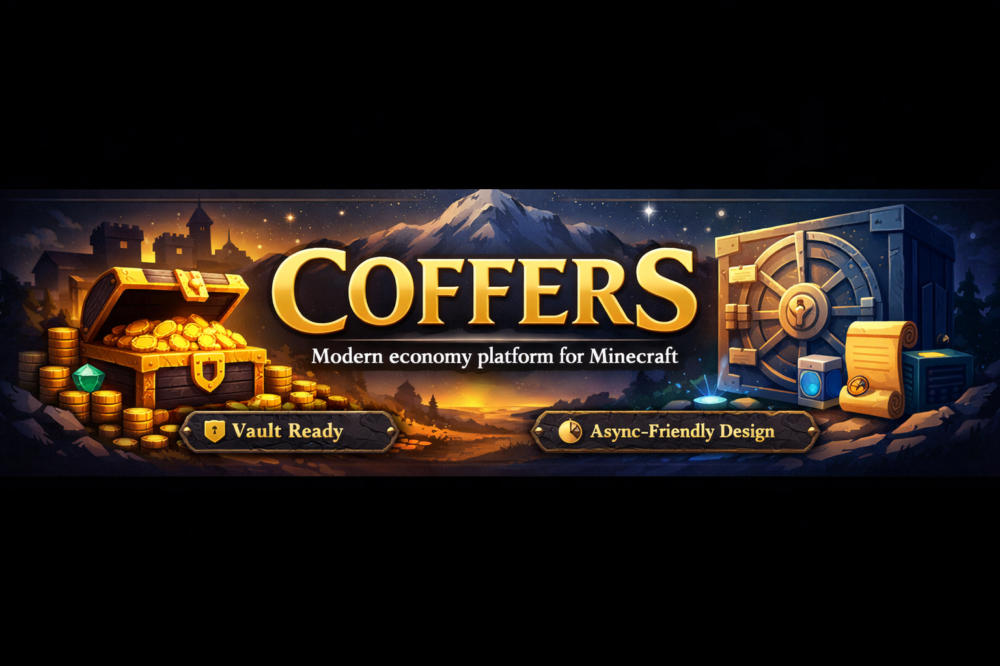

# Coffers

Coffers is a standalone-first economy platform for Minecraft servers.

It is built for server owners who want a complete economy plugin they can run directly, while still keeping Vault available as an optional compatibility layer for older plugins that may still depend on it.

For developers, Coffers also provides native API and SPI integration paths so plugins can target Coffers directly instead of relying only on older balance-only patterns.

## What Coffers Offers

- standalone economy support with no Vault requirement
- optional Vault compatibility for older plugin stacks
- YAML, SQLite, and MySQL storage backends
- configurable currencies and formatting rules
- transaction history with audit-friendly metadata
- rollback tools for correcting bad transactions
- named backups, exports, imports, and live restore tools
- restore preview, account-level restore, and validation reports
- optional personal bank accounts for players
- automatic safety backups with retention controls
- startup and shutdown safety copies
- direct API and SPI modules for plugin developers
- separate modern and legacy plugin lines

## Which Jar Is For What?

### For server owners

- `release/Coffers.jar`
  - the modern server jar
  - intended for modern Paper-based server environments
  - includes PlaceholderAPI support when PlaceholderAPI is installed

- `release/Coffers-Legacy.jar`
  - the legacy server jar
  - intended for older Bukkit-family server environments
  - designed for the `1.16.x` to `1.17.x` era and other comparable legacy-oriented setups

### For plugin developers

- `release/Coffers-API.jar`
  - the main developer API
  - intended for richer direct integrations against the modern Coffers line

- `release/Coffers-SPI.jar`
  - the service-provider interface module
  - intended for native service discovery style integrations and shared Coffers contracts

In short:

- server owners install `Coffers.jar` or `Coffers-Legacy.jar`
- plugin developers can additionally use `Coffers-API.jar` or `Coffers-SPI.jar` depending on how they want to integrate

## How Vault Fits In

Vault is optional in Coffers.

If Vault is installed and enabled in config, Coffers can register itself as a Vault economy provider so older plugins can keep working during a transition period.

If Vault is not installed, Coffers still runs normally as a standalone economy plugin.

This makes Coffers useful for both kinds of server setups:

- servers that want to keep supporting older Vault-aware plugins
- servers that want to move toward direct Coffers integrations over time

Vault bridge behavior can be set to:

- `auto`
- `enabled`
- `disabled`

## Safety And Recovery

Coffers is designed to make economy data easier to trust and easier to recover.

The modern and legacy lines both include:

- persistent balance storage
- ledger history for auditing and rollback
- named manual backups
- named exports and imports
- live restore support without requiring a restart
- restore preview reports before applying a full restore
- targeted account restore for a single player or bank
- validation reports for missing accounts, bad currency references, and bank inconsistencies
- optional scheduled safety backups
- startup and shutdown safety copies
- automated backup retention rules

This means server owners can treat Coffers as both an economy plugin and a recovery-friendly admin tool.

## Storage Backends

Coffers supports three storage modes:

- `yaml`
  - simple file storage for lightweight setups
- `sqlite`
  - local database storage for a single server
- `mysql`
  - shared database storage for larger or networked environments

Both the modern and legacy lines include these storage options.

## Banks And Player Accounts

Coffers keeps a player's main economy account separate from optional bank accounts.

That means:

- the normal account remains the primary live balance used by most economy actions
- banks can be used as personal or administrative savings accounts
- player banks can be auto-created on join if enabled in config
- backups, exports, imports, and restores preserve both bank registry data and bank balances

Banks are an economy feature, not the only recovery feature. The real recovery layer is the combination of storage, ledger history, rollback tools, and safety snapshots.

## Modern And Legacy Plugin Lines

Coffers ships in two server-owner plugin lines so each environment has a more appropriate baseline.

### Modern line

- `Coffers.jar`
- focused on the modern codebase
- includes the current admin tooling and PlaceholderAPI support

### Legacy line

- `Coffers-Legacy.jar`
- intended for older Bukkit, CraftBukkit, Spigot, Paper, and similar legacy-oriented setups
- keeps the same overall economy direction while targeting older server environments

## Core Features

Coffers currently includes:

- balance, pay, paytoggle, set, history, top, and currency commands
- transaction rollback tools
- bank administration commands
- named backups, exports, imports, and live restore support
- restore preview, targeted restore, and validation reporting
- automatic scheduled backups with retention controls
- startup diagnostics and migration reporting
- configurable chat styling
- configurable multi-currency support
- transaction audit history

## Developer Integrations

For plugin authors, Coffers offers two main integration layers.

### API

The API module includes rich economy types such as:

- currency definitions
- currency formatting rules
- account snapshots
- transaction results
- ledger entries
- transaction kinds
- actor and audit metadata

### SPI

The SPI module is intended for native service-style integrations where a plugin wants to hook into Coffers through a shared contract without relying on Vault.

This helps plugins target Coffers directly while still allowing server owners to decide whether Vault should be present for compatibility with older plugins.

## Migration Support

Coffers can import balances from another Vault-backed economy provider already present on the server.

This helps server owners move to Coffers more gradually rather than rebuilding balances by hand.

Common commands include:

- `/coffers migratevault`
- `/coffers migratevault <provider>`
- `/cofferslegacy migratevault`
- `/cofferslegacy migratevault <provider>`

## Documentation

The project wiki is included in this repository:

- `wiki/Home.md`
- `wiki/Installation.md`
- `wiki/Configuration.md`
- `wiki/Storage-Backends.md`
- `wiki/Vault-Compatibility.md`
- `wiki/Commands.md`
- `wiki/Migration-Guide.md`
- `wiki/Developer-API.md`
- `wiki/Developer-Examples.md`
- `wiki/FAQ.md`

## Project Layout

- `coffers-paper`
  - modern plugin implementation
- `coffers-legacy`
  - legacy plugin implementation
- `coffers-api`
  - developer-facing API module
- `coffers-spi`
  - shared service-provider interface module

## Downloads

- modern servers: `release/Coffers.jar`
- legacy servers: `release/Coffers-Legacy.jar`
- developers: `release/Coffers-API.jar`
- native integration contracts: `release/Coffers-SPI.jar`

## License

The current recommendation for this project is `Apache-2.0`.
